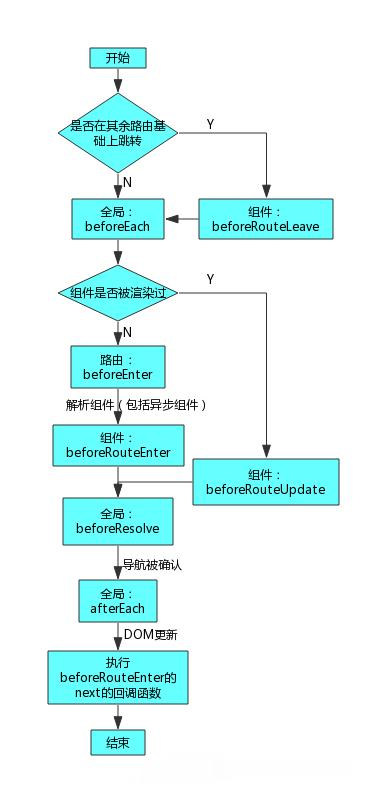

# vue3.0.0 #
1. 文档地址： [vue3官方文档](https://v3.cn.vuejs.org/guide/introduction.html)
2. data,methods等属性的代理:  
this.$options.data.someKey 和 this.someKey等价关系通过下面函数来实现 **`(伪源码) `** 
```js
    function initData (vm) {
        var data = vm.$options.data;
        vm._data = data;//在实例上创建一个_data的私有属性
        // ...methods,props等
        var key = Object.keys(data);
        var i = key.length;
        while(i--) {
            proxy(vm,"_data",key)//将vm._data代理到vm上
        }
        const commomObject = {
            enumerable: true,
            configurable: true,
            get: noop,//vue源码中 const NOOP = () => { };空函数
            set: noop
        }
        function proxy (target,suorceKey,key) {
            commomObject.get = function proxyGetter() {return this[suorceKey][key];}
            commomObject.set = function proxySetter(val) {return this[suorceKey][key] = val};
            Object.defineProperty(target,key,commomObject);//将在vm上添加key属性，值为commomObject的值，并添加get，set方法
        }
    }
```
3. vue的编译过程:  
   打包时，调用vue-template-compiler(编译器)将template,script,style部分的代码解析。【主要是调用compiler.parseComponent(file, [options])方法将整个.vue文件解析为描述性对象，进而调用vue-loader,将此描述性对象组装为ES模块，并导出为vue组件对象】这个过程  .vue文件 --> js文件，这个过程也生成了render函数。故打印的component除data,metheds等之外还添加了一个render函数。
   ```js
        //.vue
        <template>
            <div>hellow</div>
        </template>
        <script>
            export.default {
                name: HELLOW,
                data(){return{}}
            }
        </script>
        <style></style>
   ```
   <center>||</center>
   <center>compiler.parseComponent(file, [options])</center>
   <center>||</center>

   ```js
        template: {
            type: 'template',
            content: '\n<div>hellow</div>\n',
            start: 10,//除template标签以外的开始位置
            attrs: {},//</template>结束位置
            end: 37
        },
        script: {
            type: 'script',
            content: '\n' +
            'export default {\n' +
            '  name: HELLOW\n'
            '  data () {}\n' +
            '  }\n' +
            '}\n',
            start: 77,
            attrs: {},
            end: 174
        },
        styles: [
                    {
                    type: 'style',
                    content: '',
                    start: 194,
                    attrs: {},
                    end: 236
                    }
                ],
   ```

   <center>||</center>
   <center>vue-loader</center>
   <center>||</center>

    
   ```js
        {
            name: HELLOW,
            data(){return {}},
            render(){...}
        }
   ```
   render函数是由compiler.compile(template, [options])方法生成,生成之后由vue-loader加入返回的ESModule中。自此编译过程结束，也将浏览器或者node不认识的vue文件翻译成了js代码。
   ```js
        //该方法返回值
        {
            ast: ASTElement, // 解析模板生成的ast，也就是抽象语法树
            render: string,	 // 渲染函数
            staticRenderFns: Array<string>, // 静态子树
            errors: Array<string>,
            tips: Array<string>
        }
   ```

4. setup()方法的前世今生:  
   每一个组件都是一个Vue构造函数的子类,
5. ref()和reactive()方法
---


# vue-router 4.0.0 #
1. 文档地址： [vue-router4.0.0官方文档](https://next.router.vuejs.org/zh/guide/)
2. 使用方式： 
```js
    import { createRouter, createWebHashHistory } from 'vue-router';
    const routes = [];
    const router = createRouter({
        history: createWebHashHistory(),
        routes
    });
```
3. router.push()方法，中参数提供了path时params会被忽略
```js
    let param = 'you';
    router.push({name: 'my', params: { param }});//会跳到 /my/you ， you为参数
    router.push({path: '/my', params: { param }});//会跳转到 /my ，获取不到参数
```
4. router.replace() 和 router.push()的区别是前者不能返回当前的路由，而后者能
```js
    router.push({path: '/home', replace: true});
    router.replace({path: 'home'});//两者等价
```
5. this.router 和 this.route 的区别，前者是路由器负责执行，后者是路由表负责提供蓝图
6. 嵌套路由使用别名时，如别名为带‘/’的字符串，则真正的别名不用带上父级路由。
```js
    const routes = [
        {
            path: '/home',
            children: [
                {
                    path: '/son',
                    component: myComponent,
                    alias: ['/son1', 'son2']
                }
                //  /home/son    /home/son2     /son1   三者都指向myComponent组件
            ]
        }
    ]
```
7. 组件内的守卫，beforeRouteEnter()中不能访问this，beforeRouteUpdate()和beforeRouteLeave()中能访问this
8. 路由钩子的执行过程：   
   
---


# vuex 4.x #